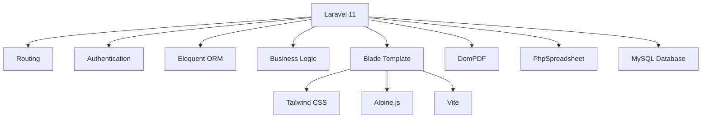
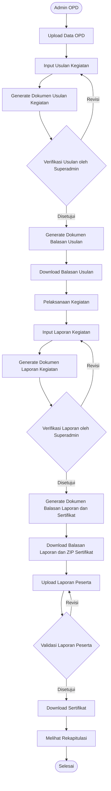

<div align="center">

# SIKOMPETEN

### Sistem Informasi Pengembangan Kompetensi Aparatur Sipil Negara (ASN)

<p align="center">
  
  
  
  
  
</p>

<p align="center">
Sistem Informasi Pengembangan Kompetensi ASN yang dikembangkan untuk mendukung proses administrasi kegiatan Pengembangan Kompetensi Aparatur Sipil Negara (ASN) pada BKPSDM Kota Surakarta.
</p>

</div>

---

# 📖 Tentang SIKOMPETEN

SIKOMPETEN (Sistem Informasi Pengembangan Kompetensi Aparatur Sipil Negara) merupakan aplikasi berbasis web yang dikembangkan sebagai implementasi Tugas Akhir pada Program Studi Diploma III Teknik Informatika Universitas Sebelas Maret.

Sistem ini bertujuan membantu proses administrasi Pengembangan Kompetensi ASN mulai dari proses usulan kegiatan, verifikasi, pelaksanaan kegiatan, pelaporan hasil kegiatan, hingga penerbitan sertifikat peserta secara digital.

Modul yang dikembangkan dalam penelitian ini meliputi:

- Generate Dokumen Administrasi
- Pelaporan Peserta
- Rekapitulasi Pengembangan Kompetensi ASN

Sistem dibangun menggunakan arsitektur **Model View Controller (MVC)** dengan framework **Laravel 11** serta menerapkan **Role-Based Access Control (RBAC)** menggunakan package **Spatie Laravel Permission**.

---

# ✨ Fitur Utama

## 📄 Generate Dokumen

Sistem mampu menghasilkan dokumen administrasi secara otomatis berdasarkan data yang telah diinput pengguna.

Fitur meliputi:

- Generate Surat Usulan Kegiatan
- Generate Surat Balasan Usulan Kegiatan
- Generate Laporan Kegiatan
- Generate Surat Balasan Laporan Kegiatan
- Generate Sertifikat Peserta

---

## 👨‍💼 Pelaporan Peserta

- Upload Laporan Peserta
- Validasi Laporan Peserta

---

## ⚙️ Fitur Pendukung

- Download Sertifikat Peserta (PDF)
- Download Sertifikat Admin OPD (ZIP)
- Upload Data OPD
- Dashboard Monitoring
- Rekapitulasi Pengembangan Kompetensi ASN
- Manajemen Pengguna
- Role-Based Access Control (RBAC)

---

# 🛠 Stack Teknologi



---

# Backend

| Teknologi | Versi | Kegunaan |
|-----------|--------|----------|
| PHP | >= 8.2 | Bahasa Pemrograman |
| Laravel | 11.x | Framework MVC |
| MySQL | >=8 | Basis Data |
| Laravel Breeze | 2.x | Authentication |
| Spatie Permission | 6.x | Role & Permission |
| Laravel DomPDF | 3.x | Generate PDF |
| PhpSpreadsheet | 5.x | Import & Export Excel |
| Intervention Image | 3.x | Pengolahan Gambar |
| Carbon | Latest | Manipulasi Tanggal |

---

# Frontend

| Teknologi | Versi | Kegunaan |
|-----------|--------|----------|
| Blade | Laravel 11 | Template Engine |
| Tailwind CSS | 3.x | Styling |
| Alpine.js | 3.x | Interaktivitas |
| Vite | 6.x | Asset Builder |
| Axios | 1.x | HTTP Request |
| Lucide Icons | Latest | SVG Icon |

---

# 🏗 Arsitektur Sistem

```
                User
                  │
                  ▼
        Laravel Breeze Authentication
                  │
                  ▼
        Role Based Access Control
                  │
        ┌─────────┴─────────┐
        ▼                   ▼
 Admin OPD            Superadmin
        │                   │
        └─────────┬─────────┘
                  ▼
          Business Logic
                  │
                  ▼
             MySQL Database
```

---

# 📁 Struktur Direktori

```text
SIKOMPETEN-BKPSDM/
├── app/
│   └── Izin/
│       ├── Http/
│       │   ├── Controllers/
│       │   │   ├── Admin/
│       │   │   ├── Superadmin/
│       │   │   ├── User/
│       │   │   └── Auth/
│       │   ├── Middleware/
│       │   └── Requests/
│       ├── Models/
│       ├── Services/
│       ├── Mail/
│       └── View/
│
├── bootstrap/
│
├── config/
│
├── database/
│   ├── factories/
│   ├── migrations/
│   └── seeders/
│
├── public/
│   ├── images/
│   └── storage/
│
├── resources/
│   ├── css/
│   ├── js/
│   └── views/
│       ├── layouts/
│       ├── components/
│       └── pages/
│           ├── dashboard/
│           ├── usulankegiatan/
│           ├── laporankegiatan/
│           ├── sertifikat/
│           ├── generatepdf/
│           └── rekapitulasi/
│
├── routes/
│   ├── web.php
│   └── auth.php
│
├── storage/
├── tests/
├── vendor/
├── .env.example
├── artisan
├── composer.json
├── package.json
├── vite.config.js
└── README.md
```

---

# 📂 Penjelasan Direktori

| Direktori | Keterangan |
|------------|------------|
| app/Izin/Http/Controllers | Controller berdasarkan role pengguna |
| app/Izin/Models | Model Eloquent |
| app/Izin/Services | Business Logic |
| app/Izin/Mail | Mail Notification |
| app/Izin/View | View tambahan aplikasi |
| database/migrations | Struktur Database |
| database/seeders | Seeder Database |
| resources/views | Blade Template |
| resources/js | Javascript |
| resources/css | Stylesheet |
| public/images | Asset Gambar |
| storage | File Upload, Cache, Log |
| routes/web.php | Routing Web |
| routes/auth.php | Routing Authentication |

---

# ✅ Persyaratan Sistem

Pastikan server memenuhi spesifikasi berikut.

| Software | Versi Minimum |
|-----------|---------------|
| PHP | 8.2 |
| Composer | 2.x |
| NodeJS | 18.x |
| npm | 9.x |
| MySQL | 8.0 |
| Git | Latest |

---

## Ekstensi PHP

Pastikan extension berikut aktif.

```text
bcmath
ctype
curl
dom
fileinfo
gd
json
mbstring
openssl
pdo_mysql
tokenizer
xml
zip
```

---

## Sistem Operasi yang Didukung

- Windows 10 / 11
- Ubuntu 22.04+
- Debian
- Linux Server
- macOS

---

## Web Browser

- Google Chrome
- Microsoft Edge
- Mozilla Firefox

---

# 🚀 Instalasi

## 1. Clone Repository

```bash
git clone https://github.com/USERNAME/SIKOMPETEN-BKPSDM.git
```

Masuk ke folder project

```bash
cd SIKOMPETEN-BKPSDM
```

---

## 2. Install Dependency PHP

```bash
composer install
```

---

## 3. Install Dependency Frontend

```bash
npm install
```

---

## 4. Copy Environment

Linux / macOS

```bash
cp .env.example .env
```

Windows CMD

```cmd
copy .env.example .env
```

Windows PowerShell

```powershell
Copy-Item .env.example .env
```

---

## 5. Generate Application Key

```bash
php artisan key:generate
```

---

## 6. Membuat Database

Masuk ke MySQL kemudian jalankan.

```sql
CREATE DATABASE izin_sikompetenasn
CHARACTER SET utf8mb4
COLLATE utf8mb4_unicode_ci;
```

---

## 7. Konfigurasi Database

Buka file `.env`.

```env
DB_CONNECTION=mysql
DB_HOST=127.0.0.1
DB_PORT=3306
DB_DATABASE=izin_sikompetenasn
DB_USERNAME=root
DB_PASSWORD=
```

---

## 8. Jalankan Migration

```bash
php artisan migrate
```

---

## 9. Jalankan Seeder

```bash
php artisan db:seed
```

atau

```bash
php artisan migrate:fresh --seed
```

> **Catatan:** Perintah `migrate:fresh --seed` akan menghapus seluruh tabel beserta datanya kemudian membuat ulang database dari awal.

---

## 10. Membuat Storage Link

```bash
php artisan storage:link
```

---

## 11. Menjalankan Aplikasi

Cara paling mudah

```bash
composer run dev
```

atau dijalankan pada terminal terpisah.

Terminal 1

```bash
php artisan serve
```

Terminal 2

```bash
npm run dev
```

Terminal 3

```bash
php artisan queue:work
```

Aplikasi dapat diakses melalui

```
http://localhost:8000
```

---

## 📌 Catatan

Apabila menggunakan Laragon cukup:

- Start Apache
- Start MySQL

Kemudian jalankan

```bash
composer run dev
```

atau

```bash
php artisan serve
```

# 🔧 Konfigurasi Environment

Berikut contoh konfigurasi dasar file `.env`.

```env
APP_NAME=Laravel
APP_ENV=local
APP_KEY=your_app_key
APP_DEBUG=true
APP_TIMEZONE=UTC
APP_URL=http://localhost

APP_LOCALE=id
APP_FALLBACK_LOCALE=en
APP_FAKER_LOCALE=en_US

APP_MAINTENANCE_DRIVER=file
APP_MAINTENANCE_STORE=database

BCRYPT_ROUNDS=12

LOG_CHANNEL=stack
LOG_STACK=single
LOG_DEPRECATIONS_CHANNEL=null
LOG_LEVEL=debug

DB_CONNECTION=mysql
DB_HOST=127.0.0.1
DB_PORT=3306
DB_DATABASE=your_name_database
DB_USERNAME=your_username_db
DB_PASSWORD=your_password_db

SESSION_DRIVER=file
SESSION_LIFETIME=120
SESSION_ENCRYPT=false
SESSION_PATH=/
SESSION_DOMAIN=null

BROADCAST_CONNECTION=log
FILESYSTEM_DISK=local
QUEUE_CONNECTION=database

CACHE_DRIVER=file
CACHE_STORE=database
CACHE_PREFIX=

MEMCACHED_HOST=127.0.0.1

REDIS_CLIENT=phpredis
REDIS_HOST=127.0.0.1
REDIS_PASSWORD=null
REDIS_PORT=6379

MAIL_MAILER=smtp
MAIL_HOST=smtp.gmail.com
MAIL_PORT=587
MAIL_USERNAME=your_email
MAIL_PASSWORD=your_pass
MAIL_ENCRYPTION=tls
MAIL_FROM_ADDRESS=mail_address_you
MAIL_FROM_NAME="SIKOMPETEN ASN"

AWS_ACCESS_KEY_ID=
AWS_SECRET_ACCESS_KEY=
AWS_DEFAULT_REGION=us-east-1
AWS_BUCKET=
AWS_USE_PATH_STYLE_ENDPOINT=false

VITE_APP_NAME="${APP_NAME}"
```

---

# 📧 Konfigurasi Email Gmail

Untuk menggunakan fitur email, lakukan langkah berikut.

1. Aktifkan **Two-Factor Authentication** pada akun Google.
2. Buka **Google App Password**.
3. Buat App Password baru.
4. Gunakan App Password tersebut pada variabel:

```env
MAIL_PASSWORD=
```

> Jangan menggunakan password utama akun Google.

---

# 💻 Referensi Perintah

## Laravel Artisan

| Perintah | Fungsi |
|-----------|---------|
| php artisan serve | Menjalankan aplikasi |
| php artisan migrate | Menjalankan migration |
| php artisan migrate:fresh --seed | Membuat ulang database |
| php artisan db:seed | Menjalankan seeder |
| php artisan storage:link | Membuat symbolic link storage |
| php artisan queue:work | Menjalankan queue worker |
| php artisan route:list | Menampilkan seluruh route |
| php artisan optimize | Optimasi Laravel |
| php artisan optimize:clear | Membersihkan cache |
| php artisan config:cache | Cache konfigurasi |
| php artisan route:cache | Cache route |
| php artisan view:cache | Cache blade |

---

## Composer

| Perintah | Fungsi |
|-----------|---------|
| composer install | Install dependency |
| composer update | Update dependency |
| composer dump-autoload | Refresh autoload |
| composer run dev | Menjalankan development environment |

---

## NPM

| Perintah | Fungsi |
|-----------|---------|
| npm install | Install package frontend |
| npm run dev | Development server |
| npm run build | Production build |

---

# 👥 Role Pengguna

SIKOMPETEN menerapkan **Role Based Access Control (RBAC)** menggunakan package **Spatie Laravel Permission**.

| Role | Deskripsi | Hak Akses |
|------|-----------|-----------|
| 👑 Superadmin | Staff Kepegawaian BKPSDM | Verifikasi usulan, verifikasi laporan, validasi laporan peserta, generate balasan, generate sertifikat, manajemen user, dashboard, rekapitulasi |
| 🏢 Admin OPD | Staff Kepegawaian Perangkat Daerah | Upload Data OPD, membuat usulan, membuat laporan kegiatan, download balasan, download ZIP sertifikat |
| 👤 User | Aparatur Sipil Negara (ASN) | Upload laporan peserta, download sertifikat, melihat status sertifikat |

---

## Middleware

Contoh penggunaan middleware role.

```php
Route::middleware(['auth','role:superadmin'])->group(function () {

    Route::resource('verifikasi-usulan', VerifikasiUsulanController::class);

});
```

---

# 🔄 Alur Sistem



---

# 🚀 Deployment Production

## 1. Ubah Environment

```env
APP_ENV=production
APP_DEBUG=false
APP_URL=https://domain-anda.go.id
```

---

## 2. Install Dependency

```bash
composer install --no-dev --optimize-autoloader

npm install

npm run build
```

---

## 3. Jalankan Migration

```bash
php artisan migrate --force
```

---

## 4. Optimasi Laravel

```bash
php artisan optimize

php artisan config:cache

php artisan route:cache

php artisan view:cache
```

---

## 5. Permission Storage

Linux

```bash
chmod -R 775 storage

chmod -R 775 bootstrap/cache
```

---

## 6. Queue Worker

Contoh Supervisor.

```ini
[program:sikompeten-worker]

process_name=%(program_name)s_%(process_num)02d

command=php /var/www/sikompeten/artisan queue:work --sleep=3 --tries=3

autostart=true

autorestart=true

user=www-data

numprocs=1

redirect_stderr=true

stdout_logfile=/var/www/sikompeten/storage/logs/worker.log
```

---

## 7. Scheduler

Tambahkan cron berikut.

```cron
* * * * * cd /var/www/sikompeten && php artisan schedule:run >> /dev/null 2>&1
```

---

# 📸 Tampilan Sistem

Tambahkan screenshot aplikasi pada bagian berikut.

```
docs/images/

dashboard.png

login.png

usulan.png

laporan.png

sertifikat.png

rekapitulasi.png
```

Kemudian tampilkan pada README.

```md
## Dashboard


## Usulan Kegiatan


## Rekapitulasi


```

---

# 📄 Lisensi

Aplikasi ini dikembangkan untuk mendukung digitalisasi administrasi Pengembangan Kompetensi Aparatur Sipil Negara (ASN) di lingkungan Pemerintah Daerah dalam rangka mencapai tujuan Good Governance dan e-Goverment sesuai tujuan yang ditetapkan.

Penggunaan aplikasi ini ditujukan untuk kebutuhan akademik, penelitian, dan pengembangan sistem informasi pemerintahan.

---

# 👨‍💻 Developer

<div align="center">

## SIKOMPETEN

**Sistem Informasi Pengembangan Kompetensi Aparatur Sipil Negara (ASN)**

Dikembangkan sebagai implementasi **Tugas Akhir** Program Studi **Diploma III Teknik Informatika** Universitas Sebelas Maret.

**Developer**

**Cheera Nur'ellyza Ade Purwahyo**

</div>
